# Pokédex

### Introdução

No mundo de Pokémon, existem criaturas chamadas Pokémons. Estas criaturas possuem
diversas caracterísiticas e atributos.

Os Pokémons se organizam em tipos, e podem ser capturados por treinadores.

Este programa é a sua Pokédex. O lugar onde você pode obter informações sobre qualquer pokémon
em uma simples busca. Além disso, você pode tentar capturar um pokémon (mas isso depende da sua
experiência como treinador) e visualizar os pokémons de outros treinadores. Pokémon! Temos que pegar!

Como utilizar?

### Requisitos:
- Uma conexão com a internet.
- O Ambiente Integrado de Desenvolvimento (IDE) Idea Intellij da JetBrains. Você pode tentar executar em outra
IDE porém  há grande possibilidade de erros, pois foram encontrados previamente pelo desenvolvedor.
	Você pode instalar a Idea Intellij clicando <a href=“https://www.jetbrains.com/idea/“>AQUI</a>. É possível utilizar uma conta premium gratuitamente entrando
com o e-mail de uma Universidade.
- Um terminal (Linux e MacOS) ou o cmd (Windows).
- Ter a ferramenta de controle de versão GIT mais atual instalada. Você pode instalar clicando <a href=“https://git-scm.com/downloads“>AQUI</a>.

### Como instalar (Linux e MacOS):
Abra o terminal e digite

> mkdir Pokedex

para criar um diretório.

Digite

> cd Pokedex

para entrar no diretório criado.

Digite

> git clone https://gitlab.com/pedroigor.silva/ep02

para fazer uma cópia da nossa Pokédex.

Após realizar o procedimento acima seu terminal deve mostrar uma mensagem como essa:

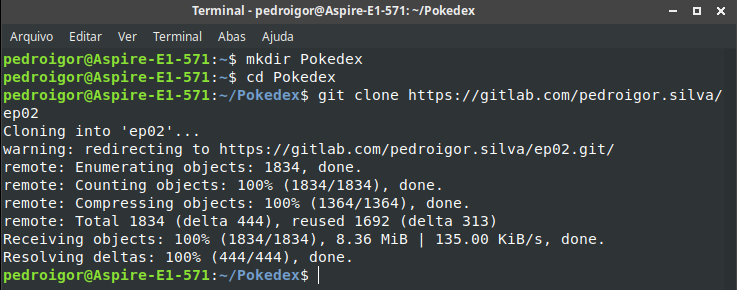

Se você recebeu uma mensagem como a da imagem, pule para a parte de "Como utilizar". Se não, verifique novamente os "Requisitos".

### Como instalar (Windows):

### Como utilizar (Todos os SO's)

1º passo: Abra o Idea Intellij e clique em "Open".

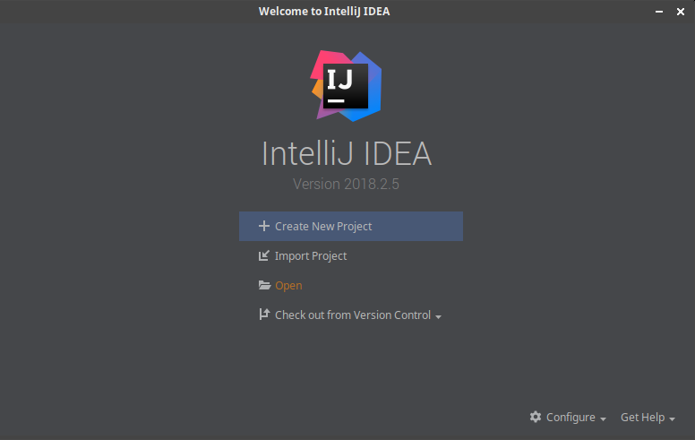

2º passo: Selecione o diretório "ep02", dentro do diretório que criamos.

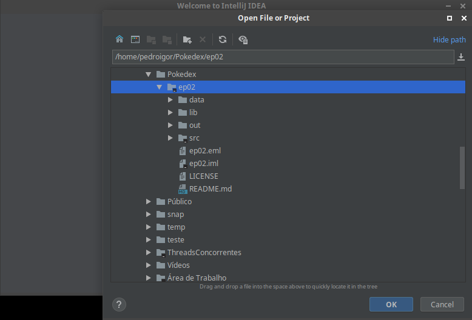

3º passo: Ao lado esquerdo do botão "run", selecione "Pokedex", caso não esteja. Após selecionado clique no botão "run".

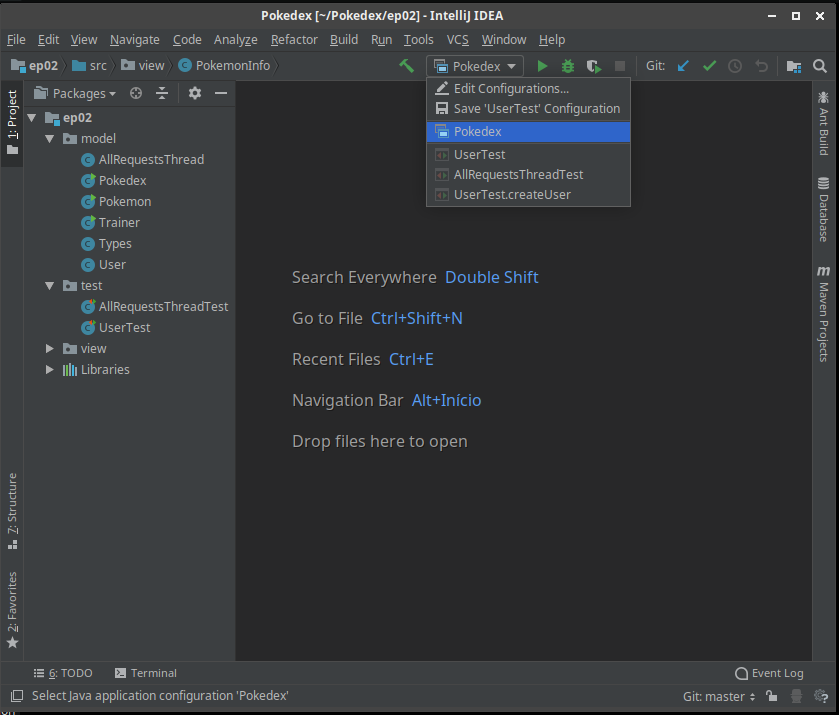

4º passo: Uma tela de login deve ser mostrada. Caso não seja mostrada, confira a parte de solução de erros ao final deste README.

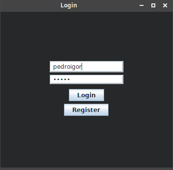

Em sua primeira utilização, escolha um nome de usuário e uma senha e clique em "Register" para cadastrar um treinador. Ele entrará automaticamente.
Nas próximas sessões, preencha os campos de usuário e senha e clique em "Login" para logar e "Register" para iniciar uma sessão.

5º passo: Já é possível visualizar a tela de menus da nossa Pokédex.

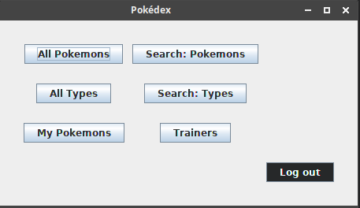

### Funcionalidades

Você pode procurar por pokemons das seguintes formas:
* Clicando em "All Pokemons", será mostrada uma lista com todos os pokémons em ordem alfabética. Ao selecionar um pokémon será mostrada todas as informações deste pokémon.

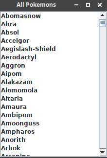

* Clicando em "Search: Pokemons", você pode digitar o nome de um pokémon. Caso esse pokémon exista será mostrada todas as informações deste pokémon.

* Clicando em "All Types", será mostrada uma lista, em ordem alfabética, com todos os tipos de pokémons disponíveis. Ao escolher um tipo serão mostrados todos os pokemons desse tipo. Ao selecionar um pokémon será mostrada todas as informações deste pokémon.
* Clicando em "Search: Types", você pode digitar o nome de um tipo. Caso esse tipo exista será mostrada uma lista em ordem alfabética com todos os pokémons desse tipo. Ao selecionar um pokémon será mostrada todas as informações deste pokémon.

Em todas essas opções, ao selecionar um pokémon, será mostrada a seguinte tela:

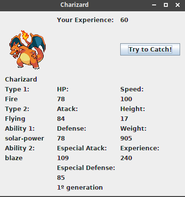

É possível visualizar atributos, foto do pokémon e o valor da sua experiência que inicia-se por padrão em 60.
Clicando no botão "Try to catch" você pode tentar capturar esse pokémon. Para capturar é necessário que sua experiência seja maior ou igual a do pokémon.
Ao capturar um pokémon sua experiência aumenta a metade da experiência do pokemon capturado.

Outras funcionalidades:

* Clicando em "My Pokemons" você pode visualizar todos os pokémons capturados por você. Selecionando um deles você pode visualizar todas as informações.

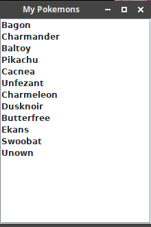

* Clicando em "Trainers" você pode visualizar todos os treinadores registrados.

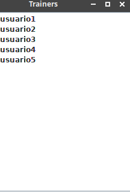 

Ao selecionar um treinador é possível visualizar todos os pokémons deste treinador. Selecionando um dos pokémons, você pode visualizar todas as informações.

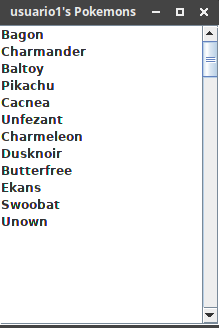

* Clicando em "Log Out" você retorna a paǵina de login podendo entrar como outro treinador ou registrar um novo.

### Resolução de erros:

Caso tenha encontrado algum erro na instalação/execução confira se todos os requisitos foram atendidos. Se sim e o erro permanece, siga o passo a passo:

No canto superior esquerdo selecione Project.

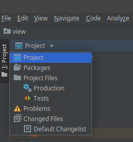

Expanda diretório "lib" clicando na setinha, clique com o botão direito sobre cada arquivo presente neste diretório e selecione "Add as Library".

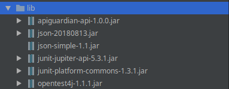

Se ainda assim os erros persistirem, baixe o zip do programa AQUI, descompacte na pasta que criamos e vá para o tópico "Como utilizar".

### Bugs:

Nada encontrado. Sinta-se livro para reportar/corrigir.